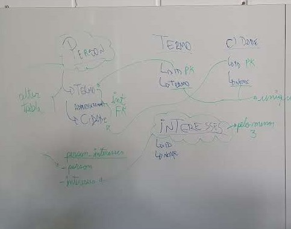
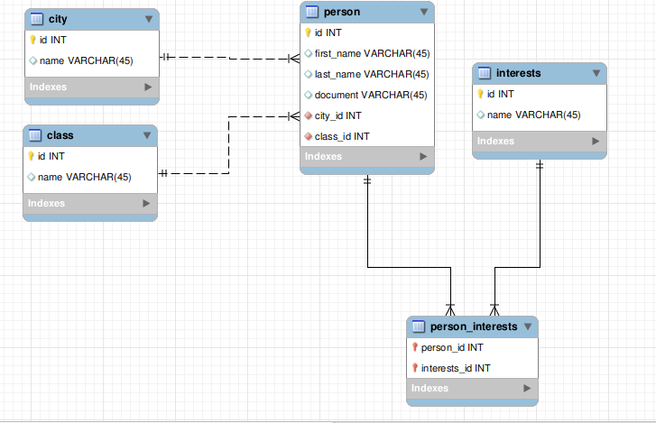

<!-- _backgroundImage: url('../../assets/raw-background.png'); -->
# Banco de Dados - Continuação

##### Diego Pereira da Silva

---
<!-- footer: Bando de dados -->

# Agenda

* Overview da Tabela
* Diagramando
* Criando as tabelas

---


# Overview da tabela



---

# Diagramando



---
# city

```sql
CREATE TABLE IF NOT EXISTS `city` (
  `id` INT NOT NULL,
  `name` VARCHAR(45) NULL,
  PRIMARY KEY (`id`));
```

---

# class

```sql
CREATE TABLE IF NOT EXISTS `class` (
  `id` INT NOT NULL,
  `name` VARCHAR(45) NULL,
  PRIMARY KEY (`id`));
```

---

# person

```sql
CREATE TABLE IF NOT EXISTS `person` (
  `id` INT NOT NULL,
  `first_name` VARCHAR(45) NULL,
  `last_name` VARCHAR(45) NULL,
  `document` VARCHAR(45) NULL,
  `city_id` INT NOT NULL,
  `class_id` INT NOT NULL,
  UNIQUE INDEX `document_UNIQUE` (`document` ASC),
  PRIMARY KEY (`id`),
  INDEX `fk_person_city_idx` (`city_id` ASC),
  INDEX `fk_person_class1_idx` (`class_id` ASC),
  CONSTRAINT `fk_person_city`
    FOREIGN KEY (`city_id`)
    REFERENCES `city` (`id`),
  CONSTRAINT `fk_person_class1`
    FOREIGN KEY (`class_id`)
    REFERENCES `class` (`id`));
```

---

# interests

```sql
CREATE TABLE IF NOT EXISTS `interests` (
  `id` INT NOT NULL,
  `name` VARCHAR(45) NULL,
  PRIMARY KEY (`id`));
```

---

# person_interests

```sql
CREATE TABLE IF NOT EXISTS `person_interests` (
  `person_id` INT NOT NULL,
  `interests_id` INT NOT NULL,
  PRIMARY KEY (`person_id`, `interests_id`),
  INDEX `fk_person_has_interests_interests1_idx` (`interests_id` ASC),
  INDEX `fk_person_has_interests_person1_idx` (`person_id` ASC),
  CONSTRAINT `fk_person_has_interests_person1`
    FOREIGN KEY (`person_id`)
    REFERENCES `person` (`id`),
  CONSTRAINT `fk_person_has_interests_interests1`
    FOREIGN KEY (`interests_id`)
    REFERENCES `interests` (`id`));
```

---

# INSERT cities

```sql
INSERT INTO city VALUES 
(1, 'Vera Cruz'),
(2, 'Marilia'),
(3, 'Pompeia'),
(4, 'Itaquaquecetuba'),
(5, 'Alvinlandia'),
(6, 'São Paulo');
```

---

# INSERT class

```sql
INSERT INTO class VALUES 
(1, '1° Termo'),
(2, '2° Termo'),
(3, '3° Termo'),
(4, '4° Termo'),
(5, '5° Termo'),
(6, '6° Termo');
```

---

# INSERT interests

```sql
INSERT INTO interests VALUES 
(1, 'Java'),
(2, 'Ruby'),
(3, 'Rusty'),
(4, 'JS'),
(5, 'Docker'),
(6, 'AI'),
(7, 'Machine Learning'),
(8, 'Pescaria'),
(9, 'Motocross'),
(10, 'xadrez');
```

---

# INSERT person

```sql
INSERT INTO person VALUES 
(1, 'Diego', 'Silva', '395.845.890-40', 2, 5),
(2, 'Murilo', 'Ziboatoi', '416.012.790-86', 4, 6),
(3, 'Diego', 'Meoes', '483.757.650-82', 2, 3),
(4, 'Ziboatoi', 'Silva', '460.216.990-25', 4, 2),
(5, 'Diego', 'Ziboatoi', '542.635.320-40', 5, 1),
(6, 'Meoes', 'Silva', '509.522.470-46', 6, 3),
(7, 'Higor', 'Meoes', '136.264.500-15', 2, 4),
(8, 'Diego', 'Machado', '297.136.920-04', 1, 5),
(9, 'Diego', 'Ops', '394.549.330-78', 3, 6),
(10, 'Diego', 'Meoes', '149.380.940-70', 4, 1),
(11, 'Thvilli', 'Silva', '500.735.190-30', 1, 4);

```

---

# INSERT interests

```sql
INSERT INTO person_interests VALUES 
(1,2),(1,3),(1,5),(1,7),(1,8),(5,9),(3,7),
(2,5),(4,3),(5,5),(9,6),(8,7),(5,8),(3,9),
(2,7),(3,2),(5,1),(9,4),(6,3),(5,7),(4,8),(3,4),
(10,5),(10,4),(10,8),(11,9),(11,5),(11,2);

```

---

# Como relacionar achar o nome de cada turma que cada um esta

```sql

SELECT person.first_name, person.last_name, city.name
FROM (person INNER JOIN city ON person.city_id = city.id);
```

```sql
SELECT person.first_name, person.last_name, city.name, class.name
FROM ((person INNER JOIN city ON person.city_id = city.id)
INNER JOIN class ON person.class_id = class.id);
```
---

# Nome da pessoa e o nome dos interesses

```sql
SELECT  person.first_name, person.last_name, interests.name
FROM person 
INNER JOIN person_interests
    ON person.id = person_interests.person_id
INNER JOIN interests
    ON interests.id = person_interests.interests_id;
```
```sql 
SELECT interests.id, interests.name, COUNT(person_interests.interests_id)
FROM person_interests INNER JOIN interests ON interests.id = person_interests.interests_id
GROUP BY person_interests.interests_id;
```

---

# Agora vamos começar a modelar nosso banco

---


# Obrigado!

